# Amazon’s AWS for deep learning: A tutorial
                
Training a deep learning model used to be one of the biggest bottlenecks in the past, not any more. The availability of affordable cloud computing space has brought it in the reach of all AI practitioners and experts. There are many competing cloud service providers, however, in this tutorial, we will be talking about AWS, the Amazon Web Service: Amazon’s cloud web hosting platform. It offers a wide range of cloud-based services and solutions. In this tutorial, we will focus on how to configure your Amazon EC2 instance for training deep learning models on the cloud.  We will start from the very beginning, from opening your account to running a deep learning model on Amazon AWS, all the steps will be explained along with the illustrations. Finally, the tutorial will explore the pricing for using AWS services as compared to owning your GPU system, allowing you to make an informed decision.

## Opening an account on Amazon

To help the beginners AWS, offers a 12 months free tier service when you first [signup](https://signin.aws.amazon.com/signin?redirect_uri=https%3A%2F%2Fportal.aws.amazon.com%2Fbilling%2Fsignup%2Fresume&client_id=signup#/start). 

You can sign up for the AWS service in 5 easy steps. Before you start, ensure that you have the following information ready at hand:

*	a working email, 
*	a credit card/debit card number
*	Tax details depending on which country you reside in
* 	Phone number

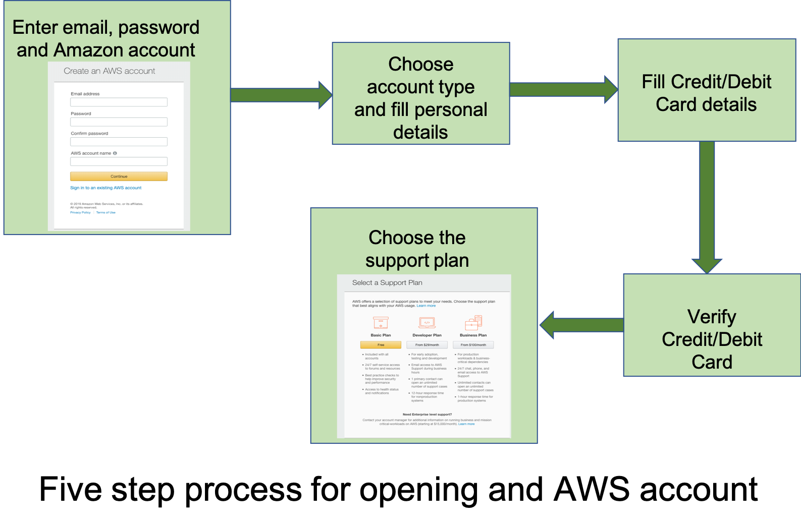

## Selecting and configuring EC2 instances

Cool! So now you are all set-up. AWS verifies every account and so it takes few hours to activate it. Once your account is activated login with your new credentials and you will see the AWS Management Console. From the Management Console you can access all AWS services.

The default free tier AWS service though very useful has certain limitations. One of them is that it does not let us use high compute machine instances. For deep learning we require high computation power and GPU. The recommended instances are **p2** and **p3**. They belong to GPU instance family and are available with 4 to 32 virtual CPUs. These instances are not eligible for the free tier usage, to use them you will need to request for the Limit increase. The limit increase request can be done from EC2 dashboard, in the left navigation panel you can see `Limits` click on it you will find a list of instances and their limits for your region (top right eg: US West `Oregon`) click on Request Limit Increase corresponding to the instance you want to use. In the tutorial we will be using `p2.x large`. 

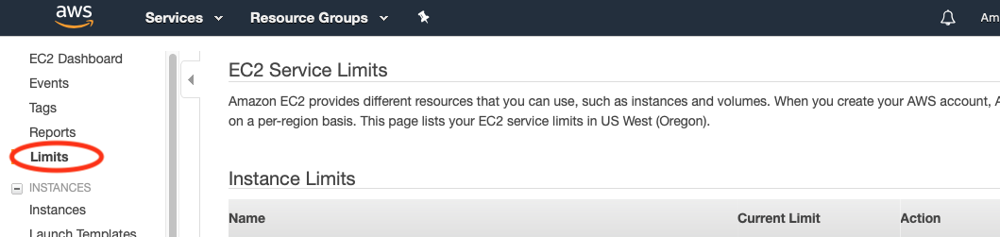


Once your request for increased limit is accepted you can move ahead. From the AWS management console we can create an EC2 compute instance for training and evaluating our deep learning model. 

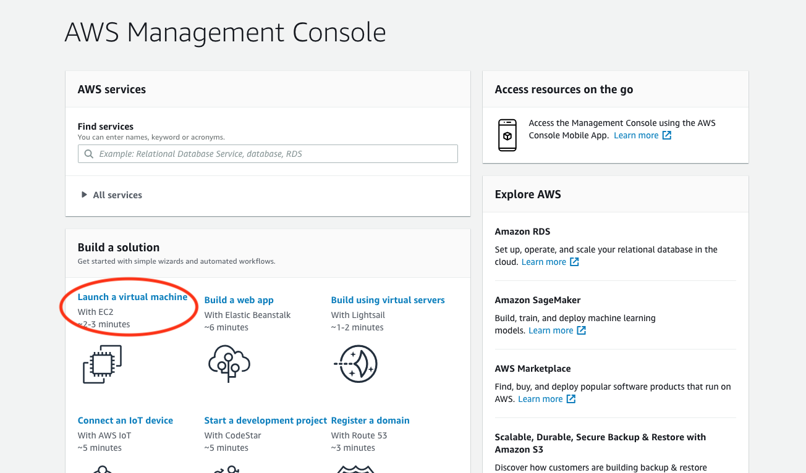

The process of creation of EC2 compute instance can be described in 7 easy steps, though if you choose default options (which we recommend for the beginner) you can launch the virtual machine in two steps. Let us start by clicking on **“Launch a Virtual Machine”.** 

1.	**Choose an Amazon Machine Image (AMI)**: AMI is a template that contains the complete software configuration of your virtual machine instance: its OS, any application server and applications it has. There are wide range of AMIs available online some free, and some at a price from the AWS Marketplace. We choose Deep Learning AMI (Ubuntu) version 21.0 which is free. 

    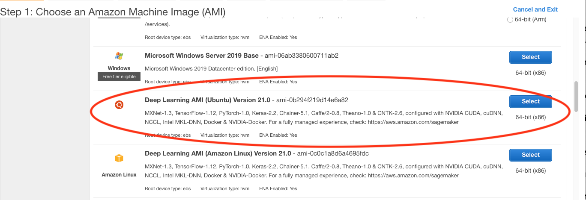

2.	**Choose the Instance type**: AWS provides a range of virtual machines with varied computation powers. We will use p2.x instance in the example. 

    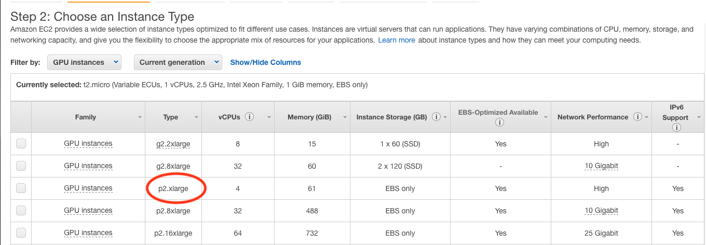

3.	**Configure Instance**: Leave it unchanged.
4.	**Add Storage**: You can specify the size of storage and the type of storage based on your need. For deep learning the best option is general purpose SSD as it is fast. For optimal performance we are here using 75 GiB size.

    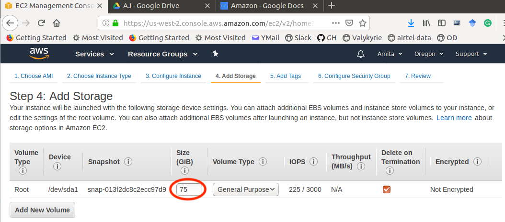

5.	**Add Tags**: You can add tags, a case-sensitive key-value label to manage your multiple AWS resources. We live it unchanged.
	
6.	**Configure Security Group**: This is one of the most important steps. We want to be able to access our machine through ssh (terminal connection), through custom TCP for Jupyter Notebook at `port 8888`, and https access. To enable this we will use **Add Rule** button and add the TCP rules one by one. We will need to set three parameters: Type, port range and source. Once we select the `type` protocol is automatically selected, for certain protocols even the `port range` is automatically defined (like 22 for ssh). Amazon provides three options for the source:
	1.	*Custom*: Here we can define a custom ip address and only that IP address will have an access to the EC2 instance.
	2.	*My IP*: Here the system provides the access permission to assigns your IP address (determined automatically). This feature is useful if you are using a dedicated internet service.
	3.	*Anywhere*: This provides access to everyone.
Below you can see the rules we have set.

    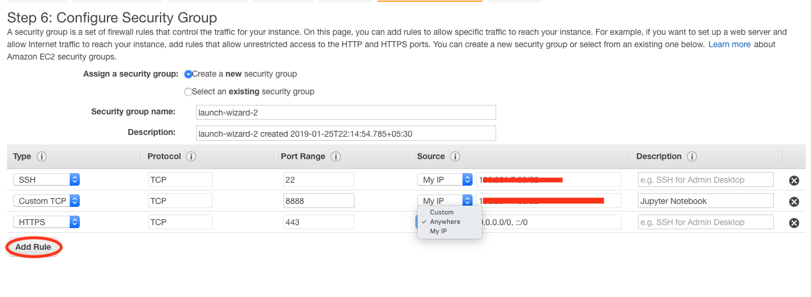

7.	**Review**: Lastly review the complete configuration and launch the instance. 
    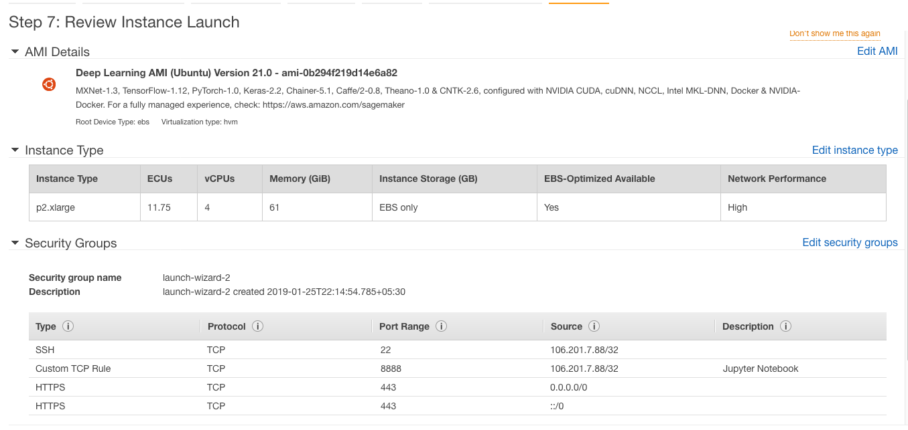

Once you launch the instance you will be asked to select an existing key-pair or create a new one or work without key-pair. The key pair allows you to securely log-in using ssh. It is advisable to have a key-pair. Here we create a new key-pair, assign it a name (we use `Key.pem`) and download. Keep your key-pair safe and note the path where it is stored. On Ubuntu or Mac change the mode of key:

`chmod 0400 Key.pem`

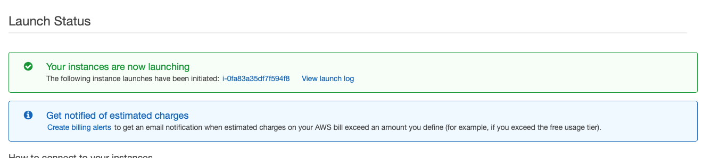
Congratulations your EC2 GPU instance is now running. It will take few minutes to initialize. You can check the running instance from the EC2 dashboard by clicking on Running Instances, it will list all your AWS running instances.

To connect to the instance you will need to note down its ip address. You can see it in the dashboard, as shown below:
 
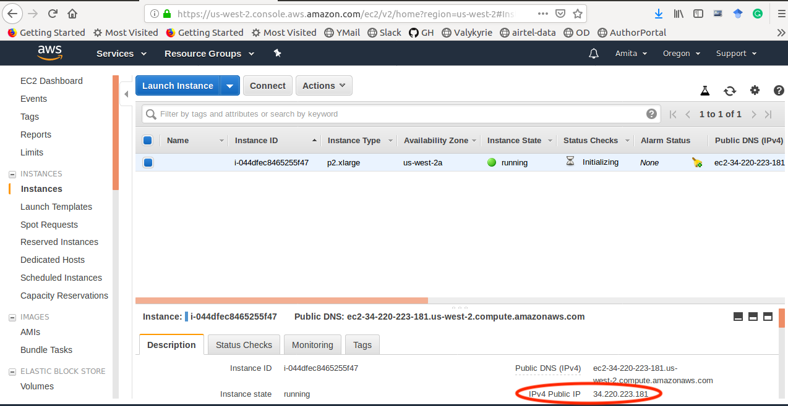
## Price Information: EC2 instance vs Local GPU machine
For the machine we have launched the price details are:

| S.No   | Virtual Machine Component  | Price per hour |
|-------|:--------:|------:|
| 1 | Deep Learning AMI (Ubuntu) version 21.0| \$0.00 per hour|
| 2 | p2.x GPU instance|\$0.900 per Hour|
| 3 | Amazon EBS General Purpose SSD (gp2) volumes 75GB|\$0.75 per month |

A respectable GPU powered laptop/desktop starts from [$1000](https://www.bestbuy.com/site/shop/laptops-with-gpu) onwards. At this cost you can use the `p2.x large` instance for 2 hours per day for 500 days. Thus, if you intend to use the machine for training on an average less than or equal to 2 hours per day, it is economical to use cloud, otherwise buy your machine.   

## Connecting and terminating   the EC2 instance

We have used Deep Learning AMI and therefore we are ready to go, we do not need to install any deep learning framework. It comes pre-loaded with MxNet, PyTorch, TensorFlow, Keras and Caffe. We can start the training the models directly after connecting. To connect to the EC2 instance we have two options:
1.	In the EC2 dashboard go to the running instance, select connect, choose the second option. The AWS will establish a secure connection to your EC2 instance and a pop-terminal will open: the window to your EC2 instance. 
    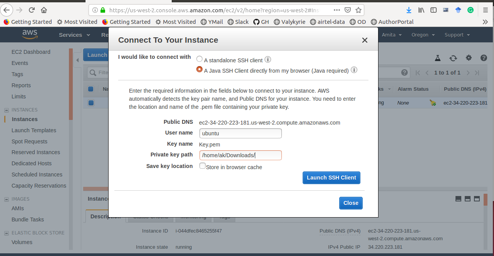

2.	Alternatively from your terminal or using PuTTy you ssh to the EC2 instance. To do this from your terminal type:
```
ssh -i path_to_key/Key.pem ubuntu@X.X.X.X 
```
    here path_to_key is the absolute path to the key you have downloaded, and `X.X.X.X` is the IP of your launched instance. This information is available on the EC2 dashboard. Below you can see the terminal on your local machine and the commands you need to run. 
    
    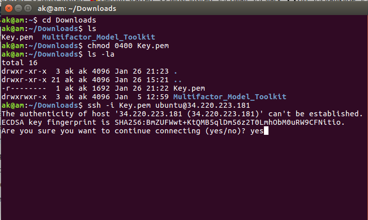


Now we are connected and have terminal access to the EC2 instance. 

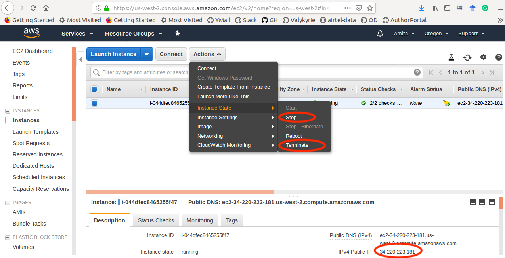


AWS charges you per hour, therefore once you have finished the work it is advisable to **Stop** or **Terminate** the instance. When you terminate the instance all charges stop, but when you Stop the instance you still have to pay for the EBS volume. To stop or terminate the instance select he instance and click `Action` -> `Instance State` you will find the options to stop or terminate as shown in the figure above.
 
## Training Deep Learning Models on EC2 instance
Jupyter Notebooks today are de-facto standard for training deep learning models, as it provides a convenient environment. So here we cover how to configure your EC2 instance to launch Jupyter Notebook.

### Configure Jupyter notebook settings
To enable Jupyter Notebook we need to create a config file  specifying the Jupyter notebook settings. In your instance terminal type: 
```
jupyter notebook --generate-config.

```
Next change the IP address config setting for notebooks we can do this using one-line command to perform an exact string match replacement or manually using `vi/vim/nano/` etc. 
```
sed -ie "s/#c.NotebookApp.ip = 'localhost'/#c.NotebookApp.ip = '*'/g" ~/.jupyter/jupyter_notebook_config.py
```
Let us now test our instance. We will run a TensorFlow Jupyter Notebook on the EC2 instance. Follow these steps:

#### On the EC2 instance:
1.	On the terminal type: 
    ```
    wget  --no-check-certificate --content-disposition https://raw.githubusercontent.com/amita-kapoor/Tutorials-DL-SE/master/DeepLearning/MNISTSoftmax.ipynb
    ```
2.	Start Jupyter Notebook: `jupyter notebook --ip=0.0.0.0 --no-browser`
3.	You will need the token generated by the jupyter notebook to access it. On your instance terminal, there will be the following line: ”Copy/paste this URL into your browser when you connect for the first time, to login with a token:”. Copy everything starting with the `:8888/?token=`.

#### On your local machine:
1.	Access the Jupyter notebook index from your web browser by visiting: `X.X.X.X:8888/?token=... ` (where `X.X.X.X` is the IP address of your EC2 instance and everything starting with `:8888/?token=` is what you just copied).
    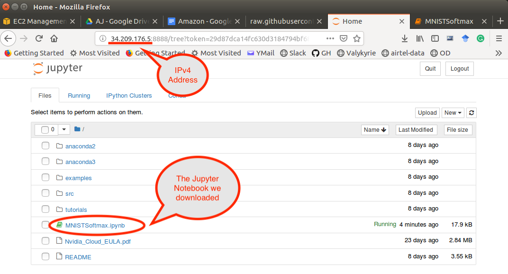
2.	Click on the ipynb file:` MNIST Softmax.ipynb`.
3.	Run each cell in the notebook
4.	The code trains a simple MLP network on MNIST dataset. 

Finally do not forget to Terminate/Stop your instance.  Have fun training your models. 
