# Microsoft Azure for deep learning
                
In the previous tutorial we learned about using Amazon's AWS for training deep learning models. This tutorial will talk about Microsoft Azure portal another competing cloud computing platform. No doubt Amazon dominates the cloud service providers market with about 41% market share, but Microsoft is also quietely gaining ground. One big advantage of Azure is that it allows one to pay as you go, that is you can use from per month billing to per minute billing depending on your need.

## Opening an account on Azure

You need a Microsoft live account to start, it is available free of cost. Use this account to [signup](https://azure.microsoft.com/en-in/free/services/virtual-machines/). Click on the **Start free** button, you will be redirected to open an account.


Depending upon the country you choose the interface will require you to submit different information.
Either case you will need to provide the following details:

*	A working email, 
*	A credit card/debit card number
* 	A phone number

Microsoft provides \$200 credit, valid for a month, plus a plethora of its free services. 

After you complete the signup you reach Microsoft Azure management portal. In case this is your first time you have two options to choose from: the **free subscription** or **choose pay as you go** option. Once you choose to work on Azure on a regular basis you can choose from pay per minute to pay per months subscriptions. Below you can see the Azure Management Portal.

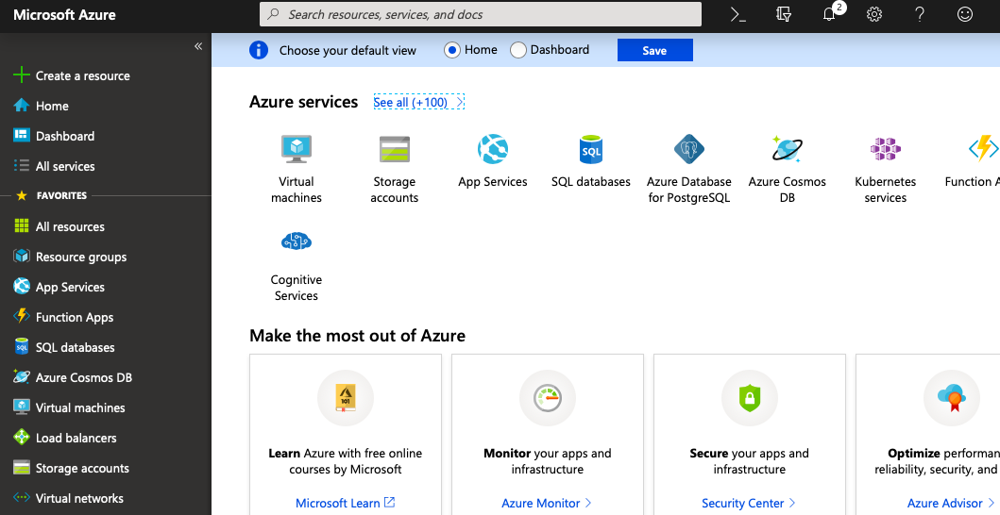

## Creating a virtual machine for deep learning

Well so all is set, let us get going and create our first deep learning virtual machine (VM) on the Azure portal. **Remember for deep learning we will require GPU compute machine with the minumum configuration NC6 and it is not avalable in free subscription plan**. 
To begin let us click on **Virtual machines**. 

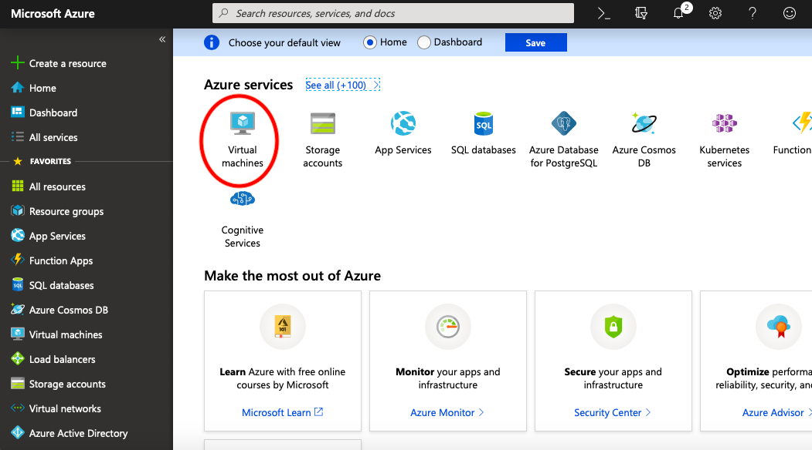

In the next page click on the **Add** button.

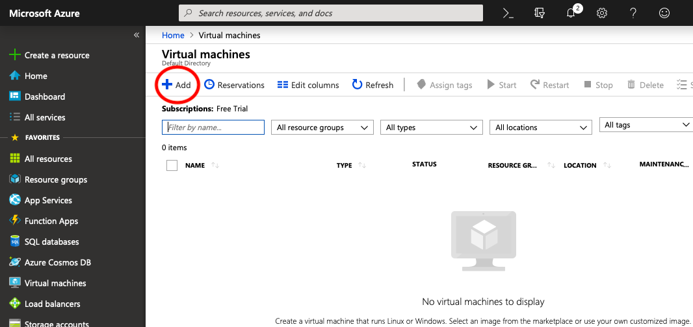

To create a virtual machine you need to:
* Specify the subscription plan
* Specify the region you want to work in, we have selected *US East*.
* Select virtual machine image. We will be choosing the [deep learning virtual machine](https://azuremarketplace.microsoft.com/en-au/marketplace/apps/microsoft-ads.dsvm-deep-learning) image.
* Confirm the compute resources you will be needing
* Select proper authentication (password or ssh-key).

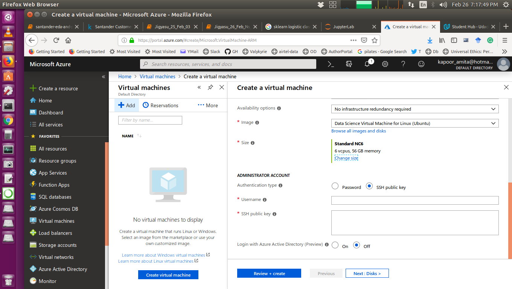

Since we are interested in creating a deep learning virtual machine, we start with selecting the image first, click "Browse all images and disks". 
 
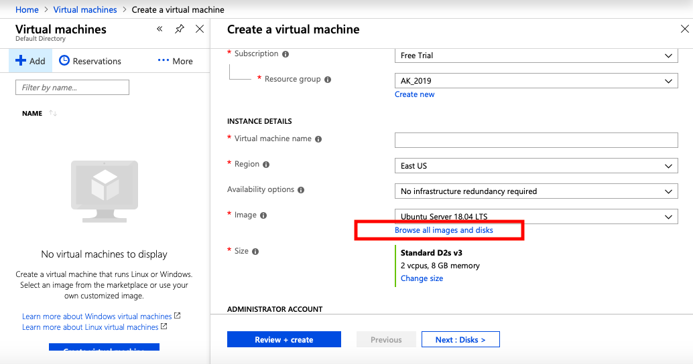

On the next page select "AI + Machine Learning".

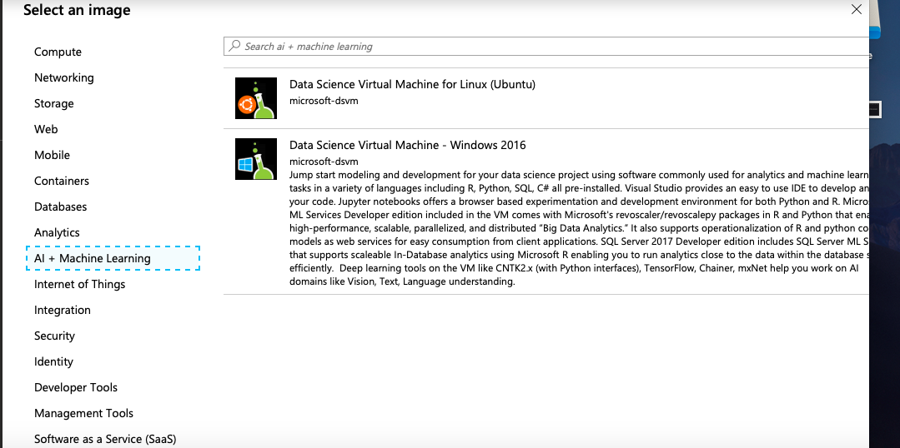

The Azure provides two options a Ubuntu machine and a Windows machine. We will be selecting the Ubuntu one here. You can try windows version too. Once you have confirmed the image, you can click on **change size** option below it and choose the basic GPU machine **NC6**. 

Once all is done verify with the selections encircled in the image below:

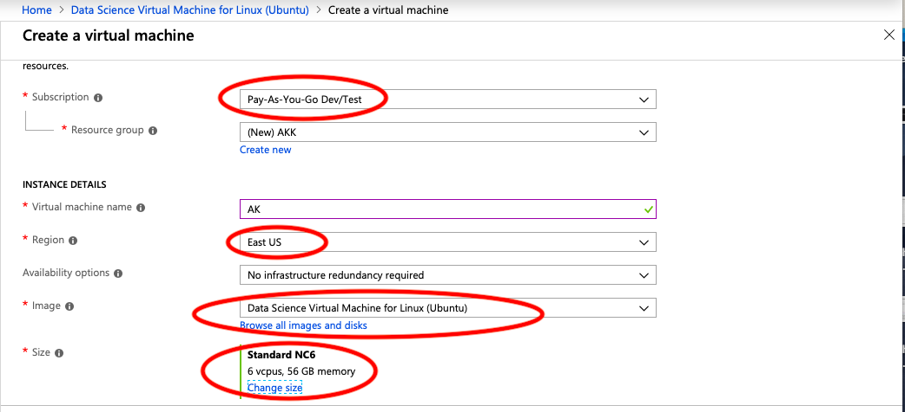


Also observe that subscription plan is no longer **Free Trial**. This is so because the **NC6** cloud machine is not avalable in free trial. Once you are satisfied choose the authentication type and click on the blue colored **Review + Create** button. Observe we have left everything else default. Once you click **Review + Create** button the Azure will check if the components you have selected is within your subscription plan and resource quota. If all goes well you will see a page like this:

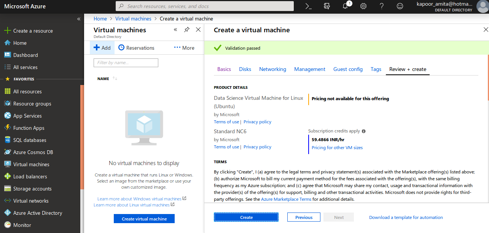

The page contains a summary of your machine configuartion and pricing. The moment you press create, Azure will start deploying the machine and you will be charged. After deployment you will see on the portal:

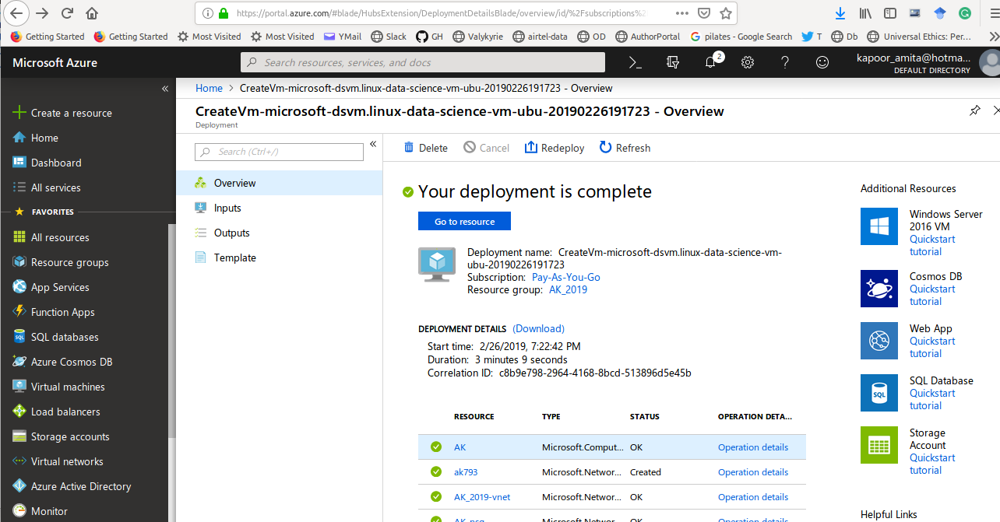

The net expense is roughly $0.90 per hour. An estimate of price for different GPU enabled machines on Azure is shown below.

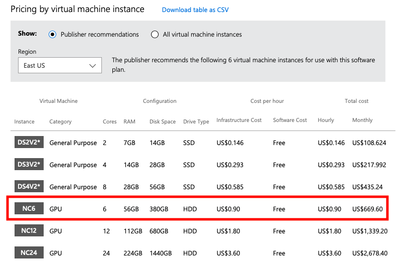

## Connecting and terminating the VM

To connect to the VM we have two options, depending upon the authentication you had selected, if you click on **Connect** both options are visible to you:
1.	You can use the username and password to login to the remote VM. 
    
2.	Alternatively depending upon your OS, you can ssh to the VM machine using either terminal or PuTTy. To do this from your terminal type:
   ```
   ssh -i path_to_your_ssh_key -L 8888:127.0.0.1:8888 myserverpaddress
   ```
    here `myserverpaddress` is  the IP of your launched instance. This information is available on the portal. 

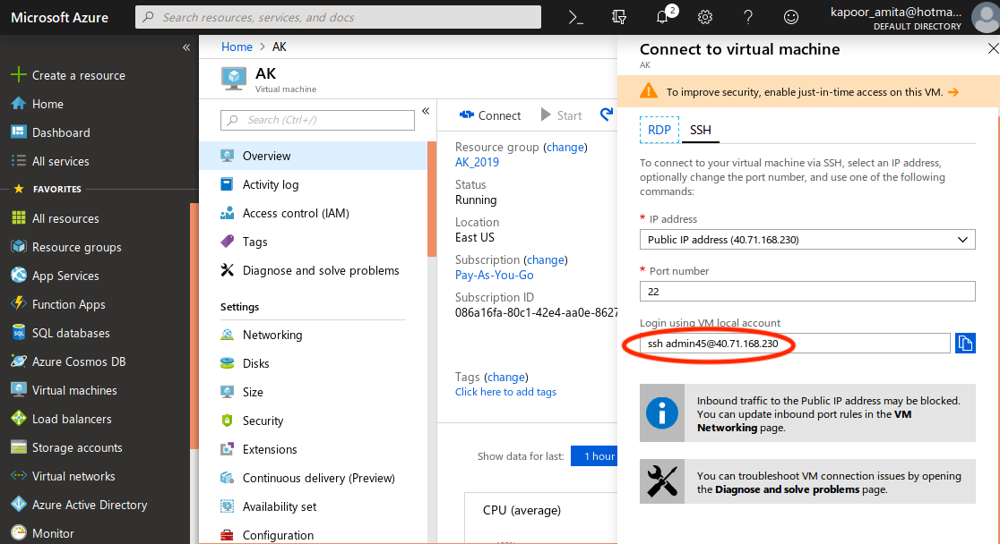
    
Below you can see the terminal on your local machine and the commands you need to run. Observe how the **prompt** changed after login.
    
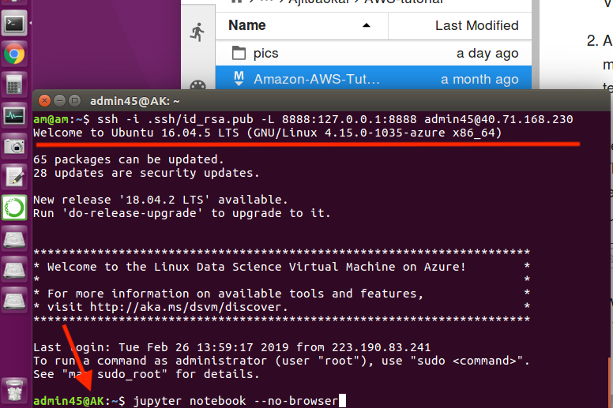


Now we are connected and have terminal access to the Azure VM. Once your work is finish, do not forget to close the machine.  And in case you do not need it again, it is safe to delete the machine along with all the resources.


 
## Launching Jupyter Notebook and training the model 

The deep learning image that we are using comes already loaded with Jupyter Notebook, so you are ready to go. Once you are connected to the VM to start Jupyter on the VM terminal run the command:

```
jupyter notebook --no-browser
```

You will see a message telling the notebook started and http address required to see it. Copy the complete adddress including the complete token as shown below:


Copy the URL token from the command line and enter in your browser to access the jupyter notebook. 

You are now ready to write your code. 

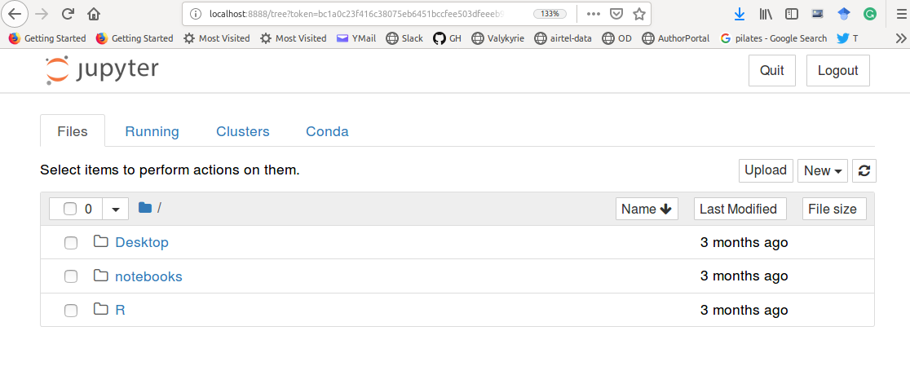

#### MNIST on Azure

Let us train a CNN to detect handwritten digits on the created VM.

1. First connect to the VM by ssh

#### On the Azure VM:

2.	On the terminal type: 
    ```
    wget  --no-check-certificate --content-disposition https://raw.githubusercontent.com/amita-kapoor/ailabs/master/MNISTSoftmax.ipynb?token=AXJi0xHXDqaGnzjGDTEsAgsDZTqy_ZIgks5cgjtAwA%3D%3D
    ```
3.	Start Jupyter Notebook: `jupyter notebook --no-browser`
4.	You will need the token and the URL generated by the jupyter notebook to access it. On your instance terminal, there will be the following line: ”Copy/paste this URL into your browser when you connect for the first time, to login with a token:”. Copy everything starting with the `http://localhost:8888/?token=`.

#### On your local machine:
1.	Access the Jupyter notebook index from your web browser by pasting the complete address you copied above. 
2.	Click on the ipynb file:` MNIST Softmax.ipynb`.

   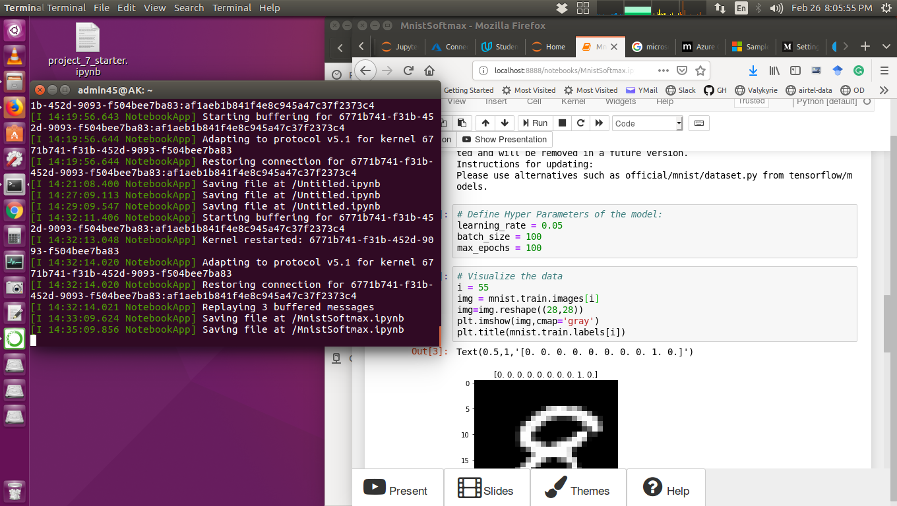
3.	Run each cell in the notebook
4.	The code trains a simple MLP network on MNIST dataset. 

Finally do not forget to Terminate/Stop your instance.  Have fun training your models. 

